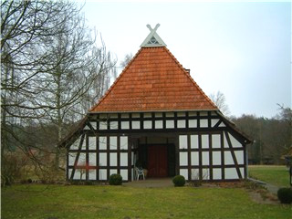
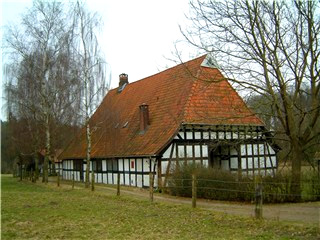
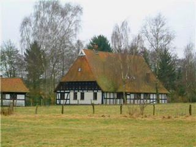
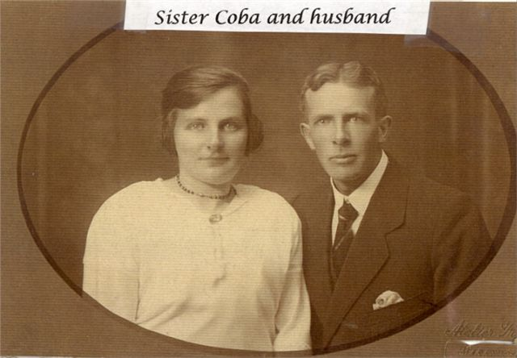
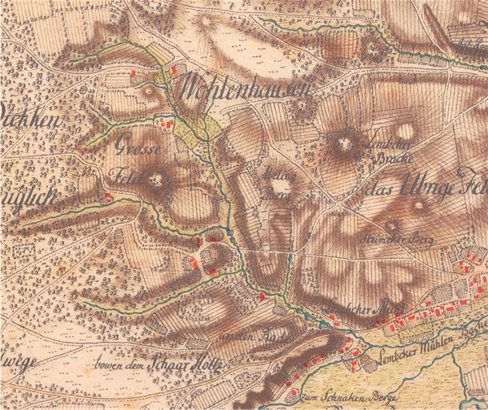

<!-- Replaceds http://familytrees.net/thorn-hedge-farm -->

 
Farmhouse built at the Hain Farm in the early 1700's. In 1863 Sophie Marie Dorothee Heine (* 2. Febr. 1820 in Wohlenhausen, + 18. Febr. 1879 in Lemke) and her husband Christian Kanning purchased the family farmhouse. As of 2005, the great-great-granddaughter of Sophie lives in the house.  

# The Old Farmhouse of Heine (Heynen, Hain, Hajne, Heins)

### In Lemke very near Wohlenhausen, Germany

According to descendants of the Heins family living in Lemke, the name Hein means thorn-hedge.  

Anne Hains and her father Johan Hain provide the origin of the Heins name that later transitioned to Heijns (in the Netherlands) and then Heyns (in the US and South Africa).

 
<a href="http://familytrees.net/info/81730">Willem Heijns</a> (b. 1853, d. 1936) and his daughter Elisabeth Heijns (b. 1889, d. 1921). Elisabeth was married to Adrian Ramp.

The following research extends a photocopy of the hand-drawn genealogy chart sent from Leen Ramp, of Boskoop, Netherlands to his cousin William Heyns in Grand Rapids, Michigan. The chart spans from 1701 to 1968 and contains about 200 relatives with drawings (tracings) of about 35 male family members. There is one female member - Johanna (Heijns) Vander Wilk (d. Aug 21, 1971) - who either created or added on to the chart. (The hand-drawn chart may incorrectly state that Anna Buelter was Peter's brother Johan's widow.)  

William Heyns writes: "Leen Ramp, son of Adrian Ramp: Adrian's first wife Elisabeth (Heijns) Ramp (b. Moerkapelle Dec 12, 1889, d. Jan 27, 1921) passed away before Leen was born to Adrian's second wife Coba, Leen's mother. Coba was a fine mother to all the Ramp children and I used to correspond with her about the whole family while she was living. Leen was also close to his half-brothers and sisters. Half-brother Wim Ramp and wife Jans (Goedhart-Ramp) inherited the Family chart from Aunt Johanna (Heijns) Vander Wilk (d. Aug 21, 1971), and on one occasion mentioned it to Leen after I had written to him about family record search. That's when Leen sent us the photocopy of the chart. All very providential and we could not have developed the website without it. Leen is now quite ill and my latest contacts have been with Wim Koster who can not write English and we must depend on his daughter to communicate." (Leen Ramp died April 23, 2001. We have stayed in contact with Jos Ramp and [Ellen Verhoeven](https://www.facebook.com/ellen.verhoeven.75).)  

Word Docs prepared by geneologist Jan Th. Kaufmann in Germany in 2002:  

[Heyns (Heins) Ancestors](../heyns/hain-farm.htm)  
[Parenteel Van Peter Freiershaus](20070204_ParenteelVanPeterFreiershaus.doc)  

---
 

<b>Email from research conducted by Jan Th. Kaufmann in April 2002. <nobr>Jens-Kaufmann@t-online.de</nobr></b>  

Loren,  

In the meantime I have been to the church archive in Hannover and did the research for the Heyns family. Please find the results as an attachment to this e-mail. I also made some photocopies of important records and will send them by airmail to you today.  

From the Marklohe church records I found the baptismal record of Johan Peter Heyn who was baptized there on 5(!) February 1701. The record says that he was baptized &quot;eodem&quot; what is the Latin word for &quot;on the same day&quot; as the previous child that was baptized on 5 February.  

When I checked the marriage record of Peter Heyn and Anna Buelter in 1704 I found that she was the widow of Johan Heyler of Mehlbergen. I also found the marriage record of Johann Heiler from Wittmershaus and of Anna Buelter from Mehlbergen who got married in Marklohe on 7 Nov 1689. So Anna's first husband was not a brother of Peter Heyn, but he was called Johann Heiler (also spelled Heyler, Heile or Heils). He died in Mehlbergen as &quot;Johann Heils&quot; and was buried in Marklohe on 16 Feb 1701.  

I did not find any baptismal records for children of Johann Heiler and Anna Buelter between 1689 and 1704 (some of the microfiche records are of a bad quality, however, so perhaps there may be any baptismal records what can be only verified from the original church records kept at the Church Office in Marklohe). Johann and Anna may have had a son, since a Johann Hinrich Heils in Wohlenhausen had baptized a daughter Catharina Elisabeth in Marklohe in 1722.  

Peter Heyn died in Wohlenhausen on 1(!) May 1735 (age 82). The day of death looks a bit like &quot;13 May&quot; but it is &quot;1ten May&quot; what means &quot;1st of May&quot;. There is a side note on this death record that is nearly illegible on microfiche. The side note looks like &quot;sonst Heils, ans Amt geschickt&quot; what would mean that his name was Peter Heine (also called Heils) and that his death record was sent to the &quot;Amt&quot;, that means to the office in Nienburg, but I am not sure about this. Due to a hole in the death records of Marklohe there is no death record for his first wife Anna Elisabeth around 1702/1703.  

It is interesting that in the death record of Johan Peter Heins in the Buecken records in 1770 it is reported that he was born in Wohlenhausen in 1701 and that <b>his father's name was Peter Freuershaus(!)</b> and his mother's name was Anna Elisabeth Heins. The photocopy of the death record is very hard to read, so please find a transcription and an English translation of this death record at the end of the attachment.  

From this death record we learn that Peter Heyn (Hain, Heins) in Wohlenhausen was originally called Peter Freuershaus and that he obivously had married into the Hain farm in Wohlenhausen and therefore he later was called Hain, Heyn or Heins. Please note that in the Hoya/Diepholz area (including Marklohe) and in Westfalen a man usually changed his name when he took over a farm that had another name (so the name of the farm was more important than the man's original surname).  

With the help of this information I finally found the marriage record of Peter Freuershaus (Peter's son from Holte) and of Anna Elisabeth Hajn (daughter of the deceased Hajn Johan from Wohlenhausen) who got married in Marklohe on 29 Jun 1682. Their youngest son Johan Peter (your ancestor) was born in 1701.  

There also were further children from this marriage (but not all baptismal records can be found on the microfiches). Peter Heyn's eldest daughter Anna Margaretha got married in Marklohe in 1704 to Hinrich Ludeking from Pennigsehl. Anna Margaretha must have been born around 1683. Another daughter of Peter Heyn (Margaretha Elisabeth) was born in Wohlenhausen in 1693 and she got married to Joachim Jacobs in 1715. A third daughter was probably Anna Cathrina Heins from Wohlenhausen who got married in Marklohe in 1724 to Herman Hinrich Flege, from Buehren.  

There also is a death record for a little son of Peter Heyn who was buried in Marklohe in 1700. He was born in 1700 and had received a private baptism (probably because of weakness).  

The eldest son of Peter and Anna Elisabeth Hain was obviously Johann Hinrich Hain (Heine). He had baptized children in Marklohe in 1728 and 1732 (and probably in 1729). There is no marriage record for Johann Hinrich Hain in Marklohe before 1728 but according to the book of Heinrich Meyerholz he is also mentioned as a farmer in Wohlenhausen in the tax list of 1731. So obviously the elder son Johann Hinrich was the heir of the Heine farm in Wohlenhausen whereas the younger son Johan Peter moved to Calle. Johann Hinrich also should be the father of Johann Peter Haine (Heine) who later owned the Heine farm in Wohlenhausen and who had baptized children there from 1745 to 1757. Johann Peter's widow Anna Catharina Schmidt got re-married in 1759 to Johann Kirchhoff who took over the Heine farm and surname in Wohlenhausen. One of Johann Peter Heine's sons later owned the farm and must be the ancestor of Dietrich Heine who (according to the book of Heinrich Meyerholz) owned the Heine farm in Wohlenhausen in 1852.  

If the side note on the death record of Peter Heine in 1735 reads indeed &quot;also called Heils&quot;, Johann Hinrich Heils (mentioned in 1722) and Johann Hinrich Heine/Hains (mentioned in 1728-1732) could be the same person. So the name of Peter's eldest son would have been Johann Hinrich Heine/Hains (also called Heils).  

According to the book of Heinrich Meyerholz on old families in the former Counties of Hoya and Diepholz the surname Heine was mentioned in Wohlenhausen already in the tax list of 1673. This must be Anna Elisabeth's father Johan Hein (Hain) who was a Vollkoetner (small farmer) in Wohlenhausen and whose farm later was owned by his son-in-law Peter Freuershaus called Heyn.  
Johan Hein was mentioned as a godfather in Wohlenhausen in 1672 and in 1675, his wife Anna was mentioned as a godmother in 1679 and 1680 and his Knecht (farm hand) Johan was mentioned as a godfather in 1680.  

There also was a Heinrich Hajn in Wohlenhausen whose widow Metta Ahmejer from Wietzen got re-married in Marklohe on 16 Nov 1681 to Everd Craft from Halenbeck. Perhaps a daughter of Heinrich Hajn was Maria Hajn who got married in Marklohe in 1694 to Harm Krafft, a son of Evert Krafft in Halenbeck.Heinrich Hajn may have been a younger brother of your ancestor Johan Hajn (see pedigree #10).  

There was a Heins family in Warpe, Buecken parish, but there cannot be established any relationship between this family and your branch in Wohlenhausen and Calle.  

The father of Peter Freuershaus called Heyn was Peter Freuershaus (#8) who lived in Holte (about 10 kilometers East of Marklohe). Three of his sons got married in Marklohe between 1677 and 1682 and it is interesting that his second son was Gerd Stuve called Freuershaus. So Peter's original name may have been Stuve or Stueve and he may have married into the Freuershaus farm in Holte. So Peter's wife could be a descendant of &quot;Cord thom Freyhershus&quot; who was mentioned in Holte already in 1521-1530. The Stueve family perhaps came from Hoya or from Buecken. In both towns we find a Gerd Stueve (also spelled Stuefe) in 1667.  
&nbsp;

 

According to the present German phonebook the surname Freuershaus (also spelled Freiershaus or Freieshaus) does not exist any longer today. There are 3 Freiershausen families (2 in Dresden, Saxony and 1 in Fintel, Lower Saxony) but they may be from another family.  

Reviewing the data I sent you I think it is not very likely that Peter Freuershaus (#8) was a son of Gerd Stueve in Hoya or Buecken (#16), but more likely that he was a brother of one of them (Peter's father would have been born around 1590 and perhaps was already dead in the 1660's). Heinrich Meyerholz did not check all early tax lists that are available at the State Archive in Hannover. So perhaps the lists of 1566, 1604-1612, 1628 and 1630 could give some more information on the Hein, Freuershaus and Stueve families. However, some of these early lists are not complete (e. g. the list of 1616 does not include the villages of Wohlenhausen and Holte). So it is doubtful whether it will be possible to find any further information beyond Peter Freuershaus and Johann Hein.

 

From the Buecken records I found some more information about the Toellner family. They had come to Calle in 1707 when Borcherdt Toellner from Hoyerhagen got married to Maria Alheidt Harde from Calle. The couple had baptized three daughters in Buecken between 1710 and 1717 and the eldest one (baptized as Margretha Angenese) should be identical with your ancestor Anna Margaretha Toellner who got married to Johan Peter Heins in 1731. In the baptismal record of her youngest daughter in 1752 Anna Margaretha was called &quot;Harde&quot; and her husband died as Johan Peter Heins called &quot;Haare&quot;. So Harde or Haare obviously was the name of the farm in Calle that was owned by Johan Peter Heins and that had previously be owned by his father-in-law Borcherdt Toellner and by the family of Borcherdt's wife Maria Alheid Harde.  

The book of Heinrich Meyerholz shows that the Toellner family had lived in Hoyerhagen already since 1530.  

Johan Peter Heins (#2) obviously lived in Wohlenhausen until 1731. He had baptized a son Diederich from his first wife there in 1725 and he had his banns for his second marriage read there in 1731 (his second wife's surname in the Marklohe records by error was written &quot;Toellmann&quot; instead of &quot;Toellner&quot;).  

If you wish further research on your Toellner and Harde ancestors from the church records of Hoyerhagen (since 1714) and of Buecken (since 1664), please let me know. Further information on your ancestor may be available from the wills and sales contracts of the Marklohe area since 1682 and from earlier tax lists that are kept at the State Archive in Hannover.  

Best regards,  

Jens Th. Kaufmann  
Reisweg 10  
38116 Braunschweig  
Germany  
 

## Peter Freiershaus (Freuershaus, zum Freyershaus) - Stuve/Stueve  
b. (Hoya or Buecken?) abt 1620  
d. Holte, Marklohe parish abt 1677/78, (Vollmeier/farmer) in Holte, mentioned in 1653 and 1667  
married before 1653 (about 1645)  

Peter's original surname may have been Stueve and his wife’s maiden name may have been Freuershaus (since they had a son Gerd Stuve/Stueve called Freuershaus). North German (Stüve): from Middle German stuve ‘stump’, hence a topographic name for someone who lived on newly cleared land.  

Peter's wife's first name is unknown.  

Children, born in Holte, baptized in Marklohe (before the beginning of the church records):  

### 1. Fr(iedr)ich Freuershaus
b. abt 1645/50,  
md. Catharina Crusemejer, daughter of the late Heinrich Crusemejer in Halenbeck, Marklohe parish 7 Aug 1677 
  
### 2. Gerd Stuve called Freuershaus
b. abt 1650  
Married: Adelheit Segelken, daughter of Carsten Segelken in Schweringen, Balge parish on 7 Nov 1678.  
Descendants: Stueve families in Schweringen in 1740/1830  

### 3. Peter Freuershaus (or Stuve called Freuershaus)

b. abt 1652/53 (or 1646 or 1656)  

View Peter's tree on [Geni.com](https://www.geni.com/people/Peter-I-Freiershaus/6000000001825345789) and 
[MyHeritage.com](https://www.myheritage.com/site-family-tree-176132761/heijns?rootIndivudalID=1000030&familyTreeID=1) 

## Peter Freuershaus (or Stuve called Freuershaus)

b. abt 1652/53 (or 1646 or 1656)  
d. Jul 13, 1735  
md. Anna Elisabeth Hajn in Marklohe on Jun 29, 1682  
md. Anna Buelter in Marklohe on Jun 12, 1704  

<b>First wife:</b> Anna Elisabeth Hain (Hajn, Heins) - our namesake - married Peter in Marklohe on 29 Jun 1682, Evangelical Lutheran Church. Anna was the daughter of the deceased Hajn Johan from Wohlenhausen.  

Peter Freuershaus changed his name to Peter Heyn in 1682 when marrying Anna Elisabeth Hain (Hajn, Heins) of the Hain Farm. The farmhouse above was built at the Hain Farm in the early 1700's and is most likely where Peter and his family lived.

In the Hoya/Diepholz area of Germany (including Marklohe) a man usually changed his name when he took over a farm that had another name (so the name of the farm was more important than the man's original surname).  

<b>Children:</b>    
1. Anna Margaretha Heynen, geboren omstreeks 1683 in Wohlenhausen, Niedersachsen (D). Zij is gedoopt in Marklohe, Niedersachsen (D). Anna Margaretha is overleden.  
2. Johann Hinrich Hain, geboren omstreeks 1685 in Wohlenhausen, Niedersachsen (D). Hij is gedoopt in Marklohe, Niedersachsen (D). Johann Hinrich is overleden.  
3. Margaretha Elisabeth Hajne, geboren in Wohlenhausen, Niedersachsen (D). Zij is gedoopt op maandag 2 maart 1693 in Marklohe, Niedersachsen (D). Margaretha Elisabeth is overleden.  
4. Anna Cathrina Heins, geboren omstreeks 1696 in Wohlenhausen, Niedersachsen (D). Zij is gedoopt in Marklohe, Niedersachsen (D). Anna Cathrina is overleden.  
5. Freuershaus, geboren op een onbekende dag in februari 1700 in Wohlenhausen, Niedersachsen (D). Hij is gedoopt op een onbekende dag in februari 1700. Hij is overleden, 0 dagen oud. Hij is begraven op zaterdag 27 februari 1700 te Marklohe, Niedersachsen (D).  
6. Johan Peter (Peter) Heins, geboren in 1701 in Wohlenhausen, Niedersachsen (D) Volgt III.  

The -s ending can indicate a female gender. It's not clear to us in America 300 years later why there is so much variance to the last names above. Did a geopolitical transition occur in 1696 that favored adding the -s.  

<b>Second wife:</b> Anna Buelter and Peter Heyn were married on June 12, 1704 in Marklohe ("parish Lohe")  
Anna Buelter from Mehlbergen (b. 1648, d. Jan 13, 1743). Anna lived to be 95!  

Source: Letter from Researcher Jan Th. Kaufmann  

Supporting details: [1780 map of Wohlenhausen, Lemke, Lohe (Marklohe) and Sud Halenbeck](img/farm/map-alte-karte.jpg).   
 
 
## Johan Peter Heyn (Heins)  
b. Wohlenhausen, Germany  
baptized on Feb 8, 1701  
m. Nov 15, 1731  
d. Jun 21, 1770  

Margarethe Catharina Toellner  
b. Apr 23, 1717 (or 1709)  
d. May 16, 1777 at Calle (age 67 and 6 months)  
(reference page 251 no 30)  

  
Lemke is northeast of Hannover, Germany  

<b>Children:</b>   
1. Anna Marie Heins, geboren in 1732 in Calle. Zij is gedoopt op vrijdag 24 oktober 1732. Anna Marie is overleden.   
2. Johan Heinrich Heins, geboren in 1734 in Calle. Hij is gedoopt op dinsdag 10 augustus 1734. Johan Heinrich is overleden.  
3. Peter Philipp Heins, geboren in 1737 in Calle Volgt IV-a.  
4. Johan Dietrich Heins, geboren in 1739 Volgt IV-b.  
5. Anna Marie Elisabeth Heins, geboren omstreeks 1742. Zij is gedoopt op dinsdag 15 mei 1742. Anna Marie Elisabeth is overleden.  
6. Frederik Heins, geboren op donderdag 28 oktober 1745 in Bücken, Niedersachsen (D) Volgt IV-c.  
7. Albert Wilhelm Heins, geboren in 1748 in Calle. Hij is gedoopt op zondag 15 september 1748. Albert Wilhelm is overleden op maandag 24 september 1759 in Calle, 11 jaar oud.  
8. Catharina Margaretha Heins, geboren omstreeks 1752 in Calle. Zij is gedoopt op woensdag 2 augustus 1752. Catharina Margaretha is overleden.  

## Frederik Heins  
b. Oct 28, 1745 Calle, Hannover, Germany  
m. Oct 10, 1773  
d. Jan 22, 1812  
Maria van den Bosch  
d. previous to 19 Jun 1816  

Frederik Heins, born in 1745 in Bucken in the Province of Hanover (Germany), moved to Bleiswijk (Netherlands), and married Maria van den Bosch, young lady born and living in Bleiswijk, on Oct 10, 1773.  

Supporting documents:  

A. <!-- was 5 -->marriage certificate of Frederik Heins, young man, born in Bucken in the Province of Hanover (Germany), living in Bleiswijk, marries 10 Oct 1773 with Maria van den Bosch, young lady living in Bleiswijk (Netherlands).  

B. <!-- was 6 -->death certificate of Frederik Heins. Death certificate witnessed by Willem Heins, aged about 26, occupation dike overseer, son of the deceased; and Teunis van der Tang, aged abt. 38, occupation farmer, neighbor of the deceased, both living in Corter-Aar (now called Korteraar - enclosed map), have declared that on the 22 Jan 1812 in Corter-Aar in the eatinghouse at District nr. 166 has died: Frederik Heins, aged 66, occupation farmer, widower of Marijtje van den Bosch.    

C. <!-- was 7 -->Family Fact Sheet and Hand-Drawn Chart  

1. Pieter b. 17742  
2. Neeltje b. 1775 (twin?)2  
3. Margrita b. 1775 (twin?)2  
4. Aaltje b. 10 Jan 17761  
5. Margrita, b.29 Jun 17771  
6. Neeltje b. 2 Aug 17781  
7. Neeltje b. 16 Jan 17801  
8. Pieter b. 17 Mar 1782 (twin)1  
9. Neeltje b. 17 Mar 1782 (twin)1  
10. Margrita b. 9 Jan 1785 (survived childhood)1  
11. [Willem Wijnant](http://familytrees.net/info/905) b. 19 Mar 1786 (survived childhood)1  
12. Neeltje b. 17 Jun 17871  
13. Pietertje b. 24 Aug. 17881  
14. Pieter b. 6 Dec. 17891  
15. Pietertje b. 9 Oct 17911  
16. Frederik b. 17 May 1795.1  
17. Maria b. 1796.2  

The family had quite a few infant deaths, quite common in those days. According to family fact sheet:  
- the first three Neeltjes died  
- the first Pieter died  
- the first Margrita died  
- the first Pietertje died.  

1. Family sheet Frederik Heins (Heyns) and Maria van den Bosch married Bleiswijk 10 Oct 1773. All children on family fact sheet born in Bleiswijk. According to family fact sheet, six of their children died, the longest living of these died at age 8.  

2. The hand-drawn chart adds four additional children indicated as dying young, who are not found on the family sheet. Days and months are from family fact sheet.  

The hand-drawn chart also notes that the family with 2 children moved to Ter Aar May 15, 1804. Under Willem Wynant Heyns there is a note that he decided to change the name "Heins" to "Heyns"  
 

[Continue to Willem Wijnant](http://familytrees.net/info/905)

