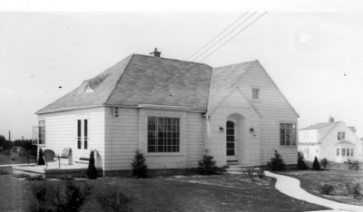

# The Life and Times of Larry Heyns

## Grand Rapid Homes

  

[Philadelphia House](https://www.realtor.com/realestateandhomes-detail/1901-Philadelphia-Ave-SE_Grand-Rapids_MI_49507_M30727-23407) - My parents had this place under construction when they were married in 1939.  

[Billanntau House](https://www.trulia.com/p/mi/grand-rapids/648-billantau-st-se-grand-rapids-mi-49507--2100073762#lil-streetViewTab) - This is where we moved when I was twelve. Take the virtual walk and see where I drove my go-cart and the dragoo.  

[2360 Glen Echo Dr.](https://www.realtor.com/realestateandhomes-detail/2360-Glen-Echo-Dr-SE_Grand-Rapids_MI_49546_M49866-82098) - Bill and Anne built this one while I was in the army.   

<!--
We stumbled onto a Louie Anderson stand-up routine on CW network last night.  It was titled "Big Underwear".  Louie is a master of deadpan.  I first saw him on Johnny Carson 25 years ago.  He seems very old, but can still up there for an hour, with perfect timing.  
-->

## Larry and William build a go-cart

Using plans from Popular Mechanics, William Heyns and 
Larry built this go-cart in the basement of the Philadelphia Ave. house during 
the winter that Larry was in sixth grade at Silvan school.  The original 
intention of restricting it to the yard or the sidewalk was soon revised due to 
its speed.  Unlike many home-made projects, this one used  new parts except for 
the steering gear that was from a model T truck at Remus' junk yard.  Some 
welding was done by a local machine shop.  Total cost was $200 in 1953.  Larry 
drove to the new house construction on Billanntau St., and later carried his 
trombone case between his legs to summer lessons at Baxter school.  After 
several years of this, a cop wrote Larry a ticket for driving without a license 
and driving an unlicensed motor vehicle.  Larry and his dad appeared before a 
judge, and agreed to dismantle the go-cart.  It was sold to Johnny VanBelois.

## Looking out the kitchen window

Cheryl, I bought a new International sleeper cab in 1973 
just as the first fuel crisis caused lines at gas stations, and truckers could 
get just enough diesel to drive a couple of hours instead of a couple of days.  
Years later, the price sky-rocketed and we got a fuel surcharge paid to the 
owner of the truck.  Then the companies sued the Federal Government, saying "You 
cannot tell us what to charge our customers".  The companies won, and the 
surcharge was folded into the rates so that I received 65% of the surcharge 
instead of 100%, in effect wiping out my profit.  Then my lease was canceled 
(along with 65 other single unit operators) to protect the multi-unit fleet 
owners during the recession of 1982.  Although I had the down-payment for a new 
tractor, I decided it was time to get out of the trucking business since no good 
leases were available.  It was a challenge and an education while it lasted 
(nine years).  I still miss looking out the kitchen window and seeing my rig 
with my name on the door.

  

## Asleep at the wheel

Cheryl, of course I think most single truck accidents are fatigue related, followed by weather related accidents.  The recent Federal attempts to revise the Hours Of Service Regulations of the 1930's seemed to be written by a committee of fools who never drove a truck.  And if passed, their proposals would have gutted the productivity and spontaneity of the trucking industry.  Unfortunately, we cannot trust drivers or dispatchers to discipline themselves because of the profit motive.  Yet, responsibility for wakefulness needs to be returned to the drivers through flexible schedules so that a driver can deal with his or her own circadian rhythm.  Now we know that fatigue is affected by how long we sleep, not how long we work.  The log book regulations do more to mess up a driver's natural sleep pattern.  I always got my rest, but not exactly when the log book said so.  

I worked Over-the-Road for many years, and always took a job with a sleeper cab so that I could get real rest when I needed it most, between 2:00 a.m. and 6:00 a.m.  With that core of prime-time sleep, I could supplement with cat-naps whenever there was an opportunity such as while waiting for a load.  I have learned not to start a trip at 3:00 a.m. because sometimes I get only as far as the first rest area.  I turned down good union jobs with Holland Motor and Roadway because their drivers are required to keep to a tight overnight schedule.  We see them napping over the steering wheel in the rest areas.  When their arms "go to sleep", they hit the road again.  Another trick is to drink coffee before the nap.  You will wake up in about twenty minutes, ready to go.  I ran two-man team for a year.  As junior driver, I had the midnight to 6:00 a.m. shift and it was tough.  Sixty hours in seven days or seventy in eight is the legal limit.  Most drivers are cheating by showing their waiting time at loading docks as time off-duty in the sleeper berth when they are actually attending to the loading process (up to another 30 hours per week).  These drivers get paid by the mile or by a percentage of the freight bill (usually 25%).  

In 1982 I sold my truck and got away from the irregular route jobs (away from home one or two weeks) when I started working for local companies where every trip was a round trip.  First I hauled hot metal to various casting plants, and the empty crucible had to be returned to Benton Harbor before it cooled too much.  Then I hauled beer from various brewerys in the U.S. and Canada for a distributor in Benton Harbor.  I stayed with them thirteen years, driving 120,000 miles some years.  After keeping my pickup appointment at the brewery (St. Louis, Milwaukee, etc.) I was on my own for resting but had to make the next pickup appointment on time.  

Finally, in 1998, I took a Transfer Driver job (hauling between plants of one company).  By staying within a 100 mile radius and punching a time clock at home base, I am not required to keep a log book anymore.  The rules allow twelve hour work shifts followed by eight hour breaks, but we have regular start times, and a second shift uses the same equipment.  So my schedule is very regular.  I get paid by the hour with time and a half after eight hours each day and all day Saturday.  Double time on Sundays and holidays.  During Cherry Season, we still cheat by showing a couple hours of lunch breaks each day so that we do not go over the seventy in eight rule.  However, the twelve hour rule is consecutive, not amended by lunch breaks.  A person can physically work twelve hours per day indefinitely, but he will forget what day it is.  

You referred to the trucks of many colors with all the "chicken" lights on the road today.  Too bad, they are not making a profit or even making their $2500 per month payment.  Most of them should have bought a cheaper, used truck instead of playing a game with a tough business.  

There is no upper age limit for drivers.  Glenn R. Myers of Kenneth City, FL started driving in 1935, and he is the senior, full time driver for Wal-Mart today.  He was a greeter for Wal-Mart until they found out he still had a CDL License.  Most old drivers fail the vision or hearing tests.  Quite a few should be on insulin for their diabetes but they risk their own health to maintain their CDL License.  We take a physical exam every two years, and half of all drivers are randomly tested for drug abuse each year.  Larry.

## Larry and Bill talk about a Packard

Dad, I posted this photo in one of my albums at the Automotive Interest Group on Classmates.com. Do you remember any details about whose car it was, and where the photo was taken? I think we were having Thanksgiving at Uncle Dan Coopers. Is that right? I also entered your story about driving the Federal stake truck at age 13 in answer to a question about "How old were you when you drove for the first time?" Larry.  

Larry, you are right about the picture taken at Uncle Dan Cooper's farm home. I think it was Uncle Neal Schuur's car. From the shape of the headlights I think it was a Packard. I remember that the road to the farm house to the county road was a single track unplowed road of about 1/4 mile and it was tricky to drive without getting stuck in all the snow. But the dinner was great and worth the trip in spite of the weather.  

At that time Grandpa VDB was driving an Oldsmobile. Later on he (and my Dad) drove low-cost models of the Cadillac (Fleetwoods?). - Dad (Bill)  

  
