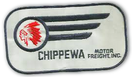
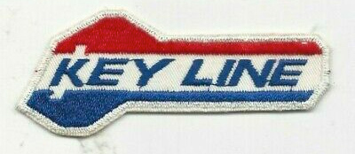

# The Life and Times of Larry Heyns

## Grand Rapid Homes

  

[Philadelphia House](https://www.realtor.com/realestateandhomes-detail/1901-Philadelphia-Ave-SE_Grand-Rapids_MI_49507_M30727-23407) - My parents had this place under construction when they were married in 1939.  

[Billanntau House](https://www.trulia.com/p/mi/grand-rapids/648-billantau-st-se-grand-rapids-mi-49507--2100073762#lil-streetViewTab) - This is where we moved when I was twelve. Take the virtual walk and see where I drove my go-cart and the dragoo.  

[2360 Glen Echo Dr.](https://www.realtor.com/realestateandhomes-detail/2360-Glen-Echo-Dr-SE_Grand-Rapids_MI_49546_M49866-82098) - Bill and Anne built this one while I was in the army.  

<!--
We stumbled onto a Louie Anderson stand-up routine on CW network last night.  It was titled "Big Underwear".  Louie is a master of deadpan.  I first saw him on Johnny Carson 25 years ago.  He seems very old, but can still up there for an hour, with perfect timing.  
-->

## Larry and William build a go-cart

Using plans from Popular Mechanics, William Heyns and 
Larry built this go-cart in the basement of the Philadelphia Ave. house during 
the winter that Larry was in sixth grade at Silvan School.  The original 
intention of restricting it to the yard or the sidewalk was soon revised due to 
its speed.  Unlike many home-made projects, this one used new parts except for 
the steering gear that was from a model T truck at Remus' junk yard.  Some 
welding was done by a local machine shop.  Total cost was $200 in 1953.  Larry 
drove to the new house construction on Billanntau St., and later carried his 
trombone case between his legs to summer lessons at Baxter school.  After 
several years of this, a cop wrote Larry a ticket for driving without a license 
and driving an unlicensed motor vehicle.  Larry and his dad appeared before a 
judge, and agreed to dismantle the go-cart.  It was sold to Johnny VanBelois.

 
   

 
Marcia behind the wheel of the dragoo - a Lincoln V-12 flathead.  

## Looking out the kitchen window

Cheryl, I bought a new International sleeper cab in 1973 
just as the first fuel crisis caused lines at gas stations, and truckers could 
get just enough diesel to drive a couple of hours instead of a couple of days.  
Years later, the price sky-rocketed and we got a fuel surcharge paid to the 
owner of the truck.  Then the companies sued the Federal Government, saying "You 
cannot tell us what to charge our customers".  The companies won, and the 
surcharge was folded into the rates so that I received 65% of the surcharge 
instead of 100%, in effect wiping out my profit.  Then my lease was canceled 
(along with 65 other single unit operators) to protect the multi-unit fleet 
owners during the recession of 1982.  Although I had the down-payment for a new 
tractor, I decided it was time to get out of the trucking business since no good 
leases were available.  It was a challenge and an education while it lasted 
(nine years).  I still miss looking out the kitchen window and seeing my rig 
with my name on the door.

  

## Asleep at the wheel

Cheryl, of course I think most single truck accidents are fatigue related, followed by weather related accidents.  The recent Federal attempts to revise the Hours Of Service Regulations of the 1930's seemed to be written by a committee of fools who never drove a truck.  And if passed, their proposals would have gutted the productivity and spontaneity of the trucking industry.  Unfortunately, we cannot trust drivers or dispatchers to discipline themselves because of the profit motive.  Yet, responsibility for wakefulness needs to be returned to the drivers through flexible schedules so that a driver can deal with his or her own circadian rhythm.  Now we know that fatigue is affected by how long we sleep, not how long we work.  The log book regulations do more to mess up a driver's natural sleep pattern.  I always got my rest, but not exactly when the log book said so.  

  

I worked Over-the-Road for many years, and always took a job with a sleeper cab so that I could get real rest when I needed it most, between 2:00 a.m. and 6:00 a.m.  With that core of prime-time sleep, I could supplement with cat-naps whenever there was an opportunity such as while waiting for a load.  I have learned not to start a trip at 3:00 a.m. because sometimes I get only as far as the first rest area.  I turned down good union jobs with Holland Motor and Roadway because their drivers are required to keep to a tight overnight schedule.  We see them napping over the steering wheel in the rest areas.  When their arms "go to sleep", they hit the road again.  Another trick is to drink coffee before the nap.  You will wake up in about twenty minutes, ready to go.  I ran two-man team for a year.  As junior driver, I had the midnight to 6:00 a.m. shift and it was tough.  Sixty hours in seven days or seventy in eight is the legal limit.  Most drivers are cheating by showing their waiting time at loading docks as time off-duty in the sleeper berth when they are actually attending to the loading process (up to another 30 hours per week).  These drivers get paid by the mile or by a percentage of the freight bill (usually 25%).  

In 1982 I sold my truck and got away from the irregular route jobs (away from home one or two weeks) when I started working for local companies where every trip was a round trip.  First I hauled hot metal to various casting plants, and the empty crucible had to be returned to Benton Harbor before it cooled too much.  Then I hauled beer from various brewerys in the U.S. and Canada for a distributor in Benton Harbor.  I stayed with them thirteen years, driving 120,000 miles some years.  After keeping my pickup appointment at the brewery (St. Louis, Milwaukee, etc.) I was on my own for resting but had to make the next pickup appointment on time.  

Finally, in 1998, I took a Transfer Driver job (hauling between plants of one company).  By staying within a 100 mile radius and punching a time clock at home base, I am not required to keep a log book anymore.  The rules allow twelve hour work shifts followed by eight hour breaks, but we have regular start times, and a second shift uses the same equipment.  So my schedule is very regular.  I get paid by the hour with time and a half after eight hours each day and all day Saturday.  Double time on Sundays and holidays.  During Cherry Season, we still cheat by showing a couple hours of lunch breaks each day so that we do not go over the seventy in eight rule.  However, the twelve hour rule is consecutive, not amended by lunch breaks.  A person can physically work twelve hours per day indefinitely, but he will forget what day it is.  

You referred to the trucks of many colors with all the "chicken" lights on the road today.  Too bad, they are not making a profit or even making their $2500 per month payment.  Most of them should have bought a cheaper, used truck instead of playing a game with a tough business.  

There is no upper age limit for drivers.  Glenn R. Myers of Kenneth City, FL started driving in 1935, and he is the senior, full time driver for Wal-Mart today.  He was a greeter for Wal-Mart until they found out he still had a CDL License.  Most old drivers fail the vision or hearing tests.  Quite a few should be on insulin for their diabetes but they risk their own health to maintain their CDL License.  We take a physical exam every two years, and half of all drivers are randomly tested for drug abuse each year.  Larry.

 

 

<h2>Fallen Flags - Old Trucking Companies of the Past</h2>

Darling Freight, Inc. (The Key Line in Transportation) was owned by Dallas Darling, one of the trucking industry's pioneers. Darling was acquainted with Matthijs Heyns, also a businessman in Grand Rapids. In 1940, when both the Darling and Heyns families were vacationing in Florida, four men took Darling's cabin cruiser to Cuba. There was a storm on the return trip, and only Matt Heyns was well enough to operate the boat.

I wish Key Line Freight of Grand Rapids, MI, was still in business. Key Line was a union company with LTL, refrigerated, steel and TL van divisions. They paid the hotel bills, and fuel was available at their terminals for their owner-operators. They were a safety minded company that used radar and Markel. Their 8-state operating authority granted in 1935 was restricted: To and From Michigan.  

Darling Freight - The Key Line in Transportation was founded by Dallas Darling. He and his wife would observe their trucks when they were on vacation, and compare their notes with drivers' logs. Dallas Darling built an innovative LTL terminal in Grand Rapids in 1954. It was a 504' Quonset Hut with beneath-the-floor chain conveyor to move dock carts. In 1967, Key Line was the 159th largest trucking company in America with 32 terminals and $12 million in revenue. Dallas' son Dan Darling bought the company in 1969. Key Line was sold to Roadway for $9 million in 1978. The Darlings then invested in an airport in Florida.  

According to Mike Terebecki's book "The Trucking Pioneers - book II", Dallas Darling got his driving experience in the U.S. Army. He purchased his first new truck in 1919. Early equipment included Biederman, Federal, Nash, Reo, Republic, and Studebaker. The company switched to diesel in the early 1950s with the purchase of 12 used B model Macks. In the early years, Dallas Darling did much of the maintenance on his equipment himself.  

In the early 1960's, Larry Heyns was familiar with the Darling LTL terminal north of 28th Street. The cross-dock operations took place in a huge Quonset building. As a yard jockey and wash boy for Direct Transit Lines, he occasionally used the Darling scales.  

Darling changed the name of the company to Key Line Freight and Dan Darling became CEO. A series of radio advertisements touted Key Line drivers as "Kings of the Road". William Heyns obtained a transcript of these ads and mailed them to Larry who was in the U. S. Army (1964-67).
In 1973, Larry was considering leasing his new International truck tractor to Orbit Transport in Illinois and was shown their operating authority. He noticed Key Line had protested their application for additional authority. Larry thought Key Line must be an alert, competitive company. Subsequently, Larry leased to Key Line's truckload van division whose office was on 76th street. He was laid off during the recession of 1974-75, but returned to Key Line because it was a very driver-friendly company with low employee turnover, union pension and insurance, company fuel pumps, etc.  

In April 1978, the Darling family sold Key Line's authority to Roadway for $9 million. The money was invested in a Florida airport, but they tried to operate some duplicate steel hauling authority without success. Due to Teamsters Union rules, Key Line drivers were offered jobs at Roadway. Their seniority was dovetailed in. One Key Line driver became second driver at Roadway's Toledo terminal because he could not dovetail into first position even though he had the most seniority. Larry preferred to continue as an owner-operator and to live in Michigan. With assistance from Key Line, many drivers hired on with R-W delivered his last Key Line load in Detroit on a Monday morning, changed the signs on the truck, and pulled an R-W load Monday night. Service System of Taylor, Michigan who took over the lease of Key Line's trailers.  

Before Key Line, I drove for Chippewa Motor Freight. Started as the only employee in Ottawa, IL, and stayed after they opened a terminal. Chippewa auctioned their authority and equipment, claiming that the ICC would not grant rate relief in spite of Teamster negotiated wage gains. I thought this happened in 1978, but the internet says 1980. Anyway, I was out of there in 1973.  

## Larry and Bill talk about a Packard

Dad, I posted this photo in one of my albums at the Automotive Interest Group on Classmates.com. Do you remember any details about whose car it was, and where the photo was taken? I think we were having Thanksgiving at Uncle Dan Coopers. Is that right? I also entered your story about driving the Federal stake truck at age 13 in answer to a question about "How old were you when you drove for the first time?" Larry.  

Larry, you are right about the picture taken at Uncle Dan Cooper's farm home. I think it was Uncle Neal Schuur's car. From the shape of the headlights I think it was a Packard. I remember that the road to the farmhouse to the county road was a single track unplowed road of about 1/4 mile and it was tricky to drive without getting stuck in all the snow. But the dinner was great and worth the trip in spite of the weather.  

At that time Grandpa VDB was driving an Oldsmobile. Later on he (and my Dad) drove low-cost models of the Cadillac (Fleetwoods?). - Dad (Bill)  

 
<caption>Larry with Uncle Neal Schuur's Packard</caption>  

## Grand Rapids boyhood adventures

There were a few adventures for city boys in the suburbs of Grand Rapids, MI in the early 1950s. As eight-year-olds, we could ride our bikes to Feenstra&rsquo;s farm, sneak into their barn and have BB gun fights. Now, adults have paint-ball war, but we were first. Occasionally, we would hang around the police speed trap and talk to the officer. Speed traps in those days used two hoses stretched across the road. A rainy day adventure might involve riding the city bus around the entire route. Do you want to go downtown and see the tall buildings? The tallest building in Grand Rapids was the thirteen-story McKay Tower, where my dad had his office. At the end of the line where Ralph Cramdon ate his lunch, we transferred to another bus. During summer vacation, we could take our sleeping bags and spend the night on the school grounds.  

Other adventures involved Plaster Creek. When the creek was flooded, we put my dad&rsquo;s small fiberglass boat into the creek, but the rushing water stuck the bow between the trunks of a forked tree. The stern bent around, causing a crack in the bottom of the boat. We did this during noon-hour from school. Sears repaired the boat under the warranty, no questions asked. Those steel tubs for hand mixing concrete or plaster made good flat-bottom boats for poling in swamps. Construction projects also provided materials for building forts in the woods.  

 
Larry's grandson Ethan explores a tunnel at the new dam construction in Anderson, South Carolina in April, 2010.  

When the creek was at a normal level, we could get our bikes into the storm sewer outlet that was six feet in diameter. Then, with flashlights, we could ride and see the city from a different perspective. If you try this at home, do it on a sunny day. Other boys would follow our progress at street level, and inform us of our location when we talked at a storm sewer grate. As the sewer narrowed, we had to leave the bikes and walk. The brave Dennis Cortman crawled into the smallest concrete pipe and wrote his name. Years later, Dennis owned a bright yellow 1949 Mercury convertible. He was a legend in his time.  

Within a few years, our adventures tapered off as we took part-time jobs, and got interested in girls. It is a wonder we survived it all.

## A sand dune runs through it

Our love of sand dunes extended beyond Michigan. Ron Jousma and I first saw Great Sand Dunes National Monument at Alamosa, CO while helping a woman move to Colorado Springs in 1962. (She would study an Indian language there before doing missionary work on a reservation). In January 1964, we returned to Alamosa in a four-wheel drive pickup with flotation tires. Vehicles are prohibited in the Monument Dunes because their tracks mare the natural beauty. However, we convinced the Director of the opportunity for him to take photos. We felt that our pickup was the first vehicle to leave tracks there since the covered wagons. Eventually, Jousma owned a twenty-mile wilderness tour based at the edge of the Monument.  

Leaving Alamosa, we explored Coral Pink Sand Dunes in Utah and met with the Park Commission in Salt Lake City to propose a dune ride there. Then we planned to explore dunes at Coos Bay, OR, and in California, but my Uncle Sam interrupted our trip with an invitation to take a pre-induction physical.  

Referring to the comments of riders at today's Saugatuck Dune Ride, a lot has changed since the 1960's. The ride is now open on Sundays. The dune area is now covered with dune grass except for the trails. There is no fast "thrill ride", due in part to the cost of insurance. We had "airplane hill", straight pipe exhaust, etc. At least they have maintained a sense of humor with the comedy road signs, mannequin legs sticking out of the sand, and driver quips. I remember setting those signs in concrete so trespassers could not steal them.  

We had to grease the dune trucks every morning. (I may have beat out other applicants for the job because of previous experience as a mechanic’s helper at Direct Transit Lines, Grand Rapids). The trails had to be graded wherever "chatter" bumps developed. Jousma would drag an I-beam over the trails with a 300 horsepower Hough front-end loader. Many nights I fell asleep in the drivers' cabin by Goshorn Lake to the sound of that loader "floating" the trails way off in the dunes. It took long hours and many gallons of gasoline to prepare for the next day's "thrill-crazy" tourists.  

To the top of our tree: [The Old Farmhouse of Heine](../../heine/)
<!-- http://familytrees.net/thorn-hedge-farm -->

